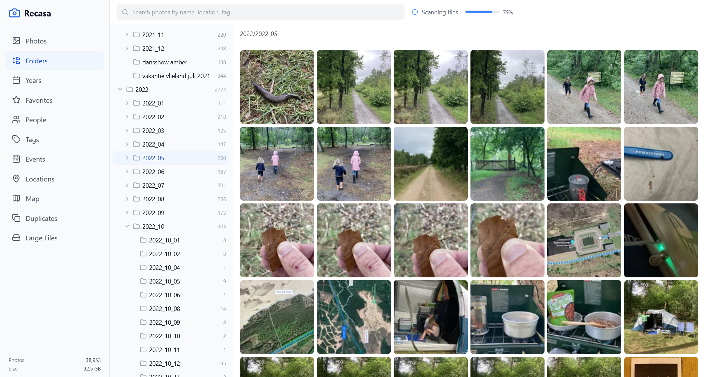
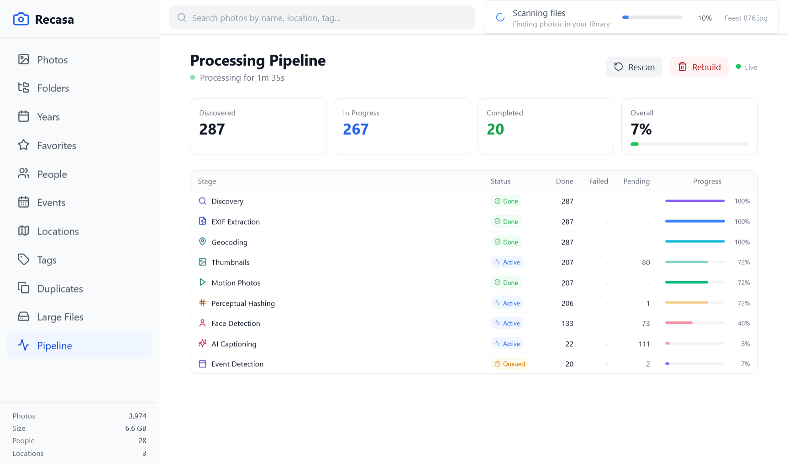

# Recasa



A self-hosted, intelligent local photo explorer. Point it at your photo directory and get a Google Photos-like experience -- without the cloud, accounts, or uploads.

Runs as a single Docker container. Your photos are mounted read-only. All processing happens locally.

## Features

- **Timeline view** -- photos grouped by month, browsable by year
- **Folder browser** -- navigate your original directory structure
- **Full-screen viewer** -- keyboard navigation (arrows, Escape, F to favorite, I for info)
- **EXIF metadata** -- camera, lens, exposure, GPS coordinates
- **Reverse geocoding** -- GPS coordinates converted to city/country names (offline)
- **Locations** -- browse by country and city, drill down to photos
- **Map view** -- all geotagged photos plotted on OpenStreetMap via Leaflet
- **AI tagging** -- scene/object/activity classification using Ollama vision models
- **Face detection** -- insightface-based detection (ONNX Runtime) + 512-dim encoding + DBSCAN clustering into persons
- **People browser** -- face thumbnails, rename people, merge duplicates
- **AI captions** -- natural language photo descriptions via Ollama (LLaVA or any vision model)
- **Full-text search** -- searches file paths, file names, locations, tags, captions, and person names
- **Event detection** -- auto-clusters photos by time proximity and location into named events
- **Duplicate finder** -- perceptual hashing (pHash/aHash/dHash) with union-find grouping
- **Large file finder** -- filter by size threshold (1MB to 50MB+)
- **Favorites** -- star photos from the grid or viewer
- **Live Photos** -- Apple Live Photos (HEIC+MOV) and Google Motion Photos (embedded MP4) with hover-to-play
- **File watching** -- detects new photos added to the directory in real-time
- **Real-time scan progress** -- WebSocket-based progress reporting during indexing
- **Deep linking** -- URL-based routing for photos, events, people, and locations (bookmarkable & shareable)
- **Scroll restoration** -- remembers your position when navigating back
- **Scan cancellation** -- stop a running scan at any time
- **Tools submenu** -- organized navigation for utilities (duplicates, large files)

## Quick Start

```bash
# Clone the repo
git clone https://github.com/yonie/recasa.git
cd recasa

# Configure
cp .env.example .env
# Edit .env -- set PHOTOS_PATH to your photo directory

# Run
docker compose up -d
```

Open `http://localhost:8080` (or whatever port you set in `RECASA_PORT`).

On first launch, Recasa will scan your photo directory and process all files through the pipeline. Progress is shown in the UI via a real-time progress bar.

## Configuration

All configuration is via environment variables (set in `.env`):

| Variable | Default | Description |
|----------|---------|-------------|
| `PHOTOS_PATH` | *(required)* | Host path to your photo directory (mounted read-only) |
| `RECASA_PORT` | `8080` | Port for the web UI |
| `OLLAMA_URL` | `http://ollama:11434` | Ollama API URL for AI captioning |
| `WATCH_INTERVAL` | `30` | Filesystem watch debounce interval (seconds) |
| `LOG_LEVEL` | `info` | Logging level (`debug`, `info`, `warning`, `error`) |

## Architecture

```
Browser <---> nginx (:8080)
                |
        +-------+-------+
        |               |
   React SPA       FastAPI (:8000)
   (static)             |
                   SQLite (async)
                        |
                  /photos (read-only)
                  /data   (persistent)
                    ├── db/recasa.db
                    ├── thumbs/
                    ├── faces/
                    └── motion_videos/
```

Single Docker container running:
- **nginx** -- serves the React frontend build and proxies `/api` to the backend
- **FastAPI + uvicorn** -- async Python backend with SQLAlchemy + aiosqlite
- **Background pipeline** -- processes photos through 10 stages on startup and for new files

### Processing Pipeline

Each photo goes through these stages (ML stages gracefully skip if dependencies are unavailable):



1. **Discovery** -- walk directory, compute SHA-256 hashes, index new files
2. **EXIF extraction** -- camera metadata, GPS, dates via Pillow
3. **Geocoding** -- offline reverse geocoding via `reverse_geocoder`
4. **Thumbnails** -- multi-resolution WebP thumbnails (200/600/1200px)
5. **Motion photos** -- extract embedded MP4 from Google Motion Photo JPEGs
6. **Perceptual hashing** -- pHash/aHash/dHash for duplicate detection
7. **AI tagging** -- scene/object classification using Ollama vision models
8. **Face detection** -- insightface detector (ONNX Runtime) + 512-dim encodings + DBSCAN clustering
9. **Ollama captioning** -- vision model generates natural language descriptions
10. **Event detection** -- auto-clusters photos by time and location

## Supported Formats

**Photos:** JPEG, PNG, WebP, HEIC/HEIF, TIFF, BMP

**Live Photos:**
- Apple Live Photos -- HEIC/JPEG paired with same-name .MOV file
- Google Motion Photos -- MP4 embedded at the end of JPEG files

## Ollama Integration

For AI-generated captions, run Ollama alongside Recasa:

```yaml
# docker-compose.yml already supports this via the OLLAMA_URL env var
# Just run Ollama separately:
docker run -d --name ollama -p 11434:11434 ollama/ollama
docker exec ollama ollama pull qwen3-vl:30b-a3b-instruct
```

Then set `OLLAMA_URL=http://host.docker.internal:11434` in your `.env`.

Captioning is optional -- if Ollama is unreachable, the pipeline skips it and everything else works fine.

## ML Features

The Docker image attempts to install ML dependencies (insightface, onnxruntime, opencv-python-headless, scikit-learn). If the install fails (e.g., on resource-constrained systems), the core app still works -- ML features are skipped gracefully.

ML features that require these dependencies:
- AI tagging (requires Ollama vision model)
- Face detection and clustering (requires `insightface`, `onnxruntime`, `scikit-learn`)

Features that work without ML dependencies:
- Photo browsing, timeline, folders, years
- EXIF extraction, thumbnails, geocoding
- Duplicate detection (perceptual hashing)
- Favorites, search (by filename/location)
- Event detection (time/location clustering)
- Live Photo support
- Ollama captioning (only needs a running Ollama instance)

## Tech Stack

**Backend:** Python 3.11, FastAPI, SQLAlchemy 2 (async), aiosqlite, Pillow, pillow-heif, imagehash, watchdog, reverse-geocoder, httpx

**Frontend:** React 18, TypeScript, Vite 6, TailwindCSS, Zustand, React Router, Leaflet, Lucide icons

**ML (optional):** insightface, onnxruntime, opencv-python-headless, scikit-learn

**Infrastructure:** Docker, nginx, Ollama (optional sidecar)

## API

All endpoints are under `/api`. Key routes:

| Endpoint | Description |
|----------|-------------|
| `GET /api/photos` | Paginated photo list with filtering and search |
| `GET /api/photos/{hash}` | Full photo detail (EXIF, location, tags, faces, caption) |
| `GET /api/photos/{hash}/thumbnail/{size}` | WebP thumbnail (200, 600, or 1200px) |
| `GET /api/photos/{hash}/original` | Original photo file |
| `GET /api/timeline` | Photos grouped by year/month/day |
| `GET /api/directories` | Directory tree with photo counts |
| `GET /api/persons` | Recognized people with face thumbnails |
| `GET /api/tags` | Tags with counts, filterable by category |
| `GET /api/events` | Auto-detected events with cover photos |
| `GET /api/locations/map-points` | Clustered GPS points for map display |
| `GET /api/locations/countries` | Countries with photo counts |
| `GET /api/duplicates` | Perceptual duplicate groups |
| `GET /api/large-files` | Photos above a size threshold |
| `WS /api/scan/ws` | Real-time scan progress via WebSocket |
| `GET /api/health` | Health check |

## License

MIT
