# Recasa

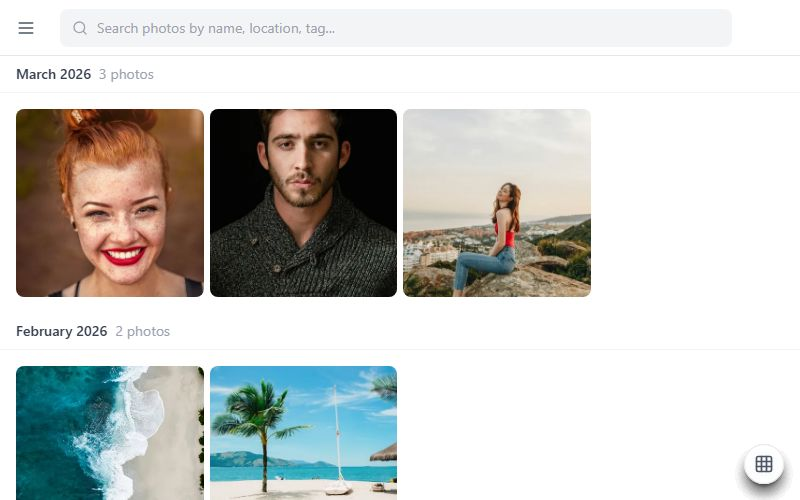

Self-hosted photo manager. Browse and organize photos by people, places, events, and tags -- all processed locally on your machine.

## Installation

Requires [Docker](https://docs.docker.com/get-docker/).

```bash
git clone https://github.com/yonie/recasa.git
cd recasa
cp .env.example .env
```

Edit `.env` and set `PHOTOS_PATH` to your photo directory:

```
PHOTOS_PATH=/path/to/your/photos
```

Then start the container:

```bash
docker compose up -d
```

Open http://localhost:8080. Recasa will scan your photos and index them. Processing progress is shown in the UI.

## Features

- **Timeline** -- photos grouped by month and year
- **People** -- face detection and clustering into renameable persons
- **Events** -- automatic grouping by time and location
- **Map** -- geotagged photos on OpenStreetMap, with a Hero Trail mode that replays your route chronologically
- **Search** -- file names, locations, tags, captions, and people
- **Tags** -- AI-generated scene/object tags (requires Ollama)
- **Captions** -- natural language descriptions per photo (requires Ollama)
- **Duplicates** -- perceptual hash grouping (pHash/aHash/dHash)
- **Favorites** -- star photos from the grid or viewer
- **Folders** -- browse by original directory structure
- **Years** -- quick access to any year
- **Live Photos** -- hover-to-play for Apple Live Photos and Google Motion Photos
- **EXIF** -- camera, lens, exposure, GPS metadata
- **Reverse geocoding** -- GPS coordinates to city/country names, offline with no API keys
- **File watching** -- new photos are detected automatically

Photos are never uploaded. They are mounted read-only into the container.

## Screenshots

| | |
|---|---|
|  | 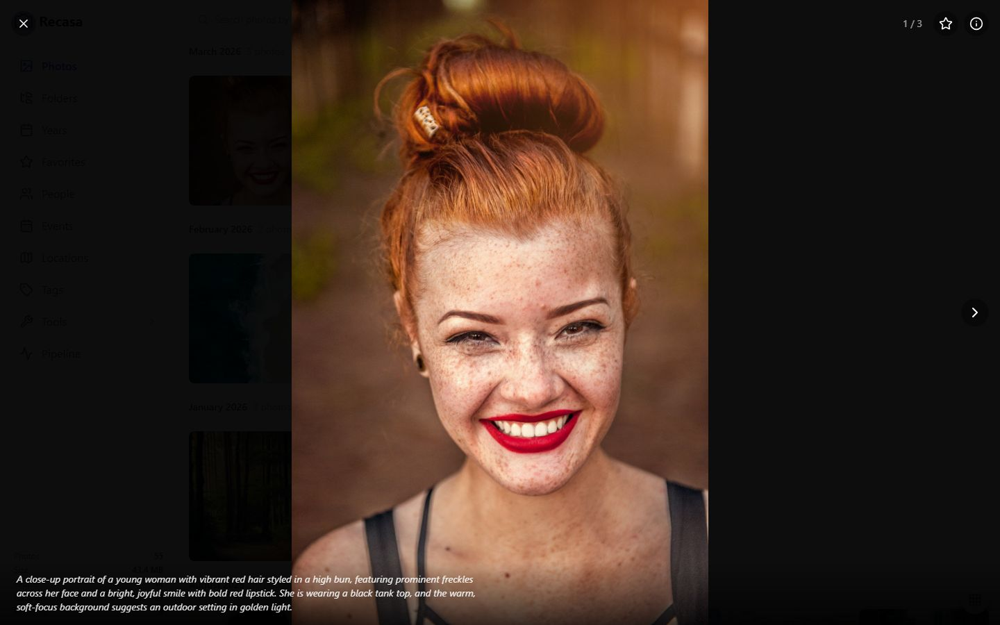 |
| *Timeline* | *Photo Viewer* |
| 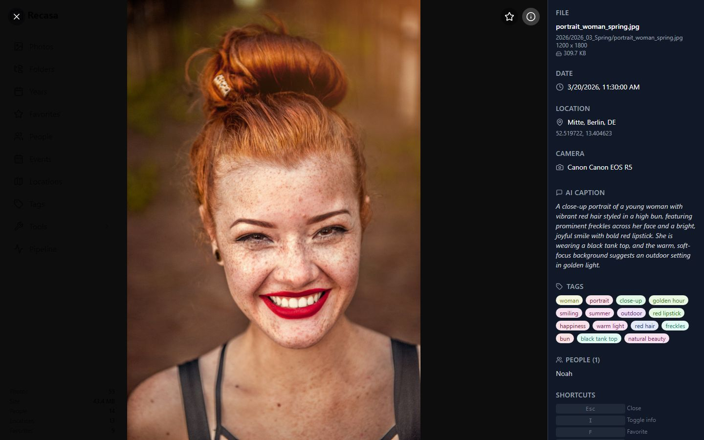 | 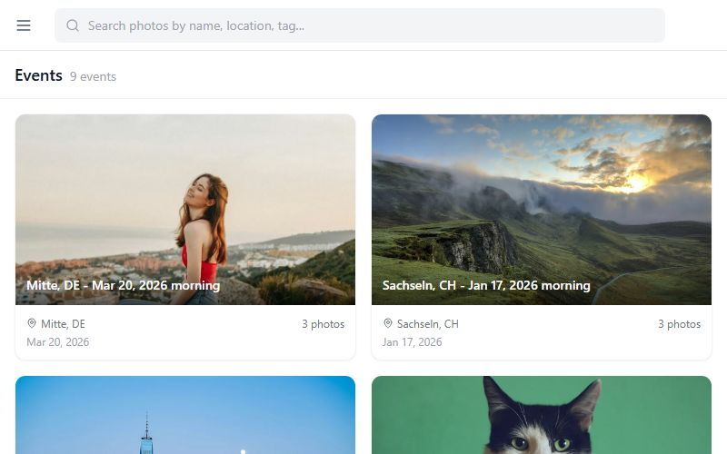 |
| *Photo Detail* | *Events* |
| 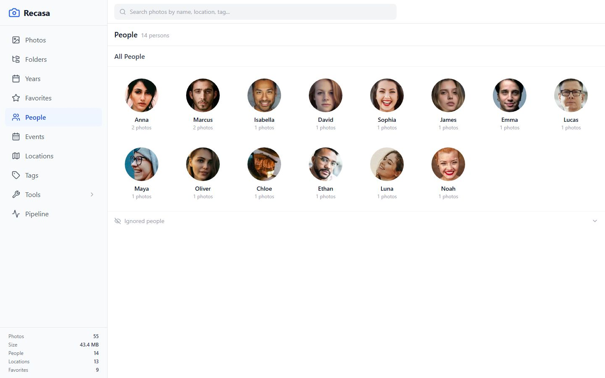 | 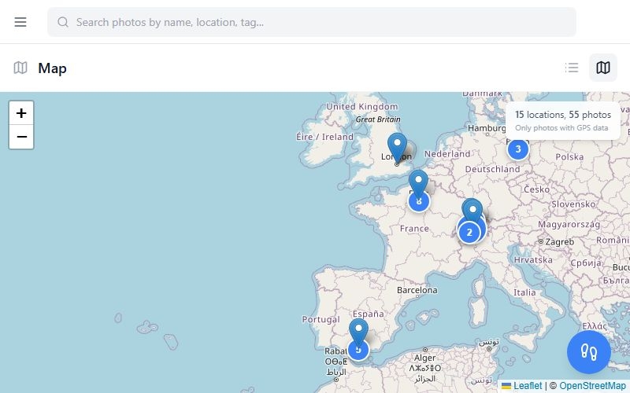 |
| *People* | *Locations* |
| 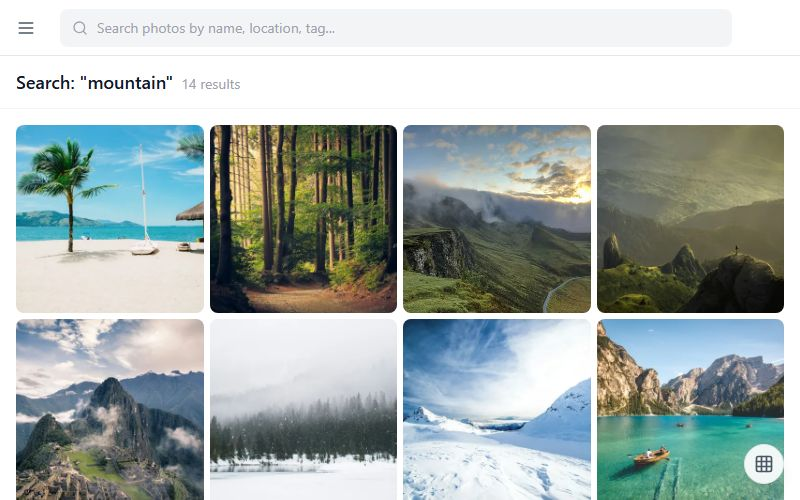 | 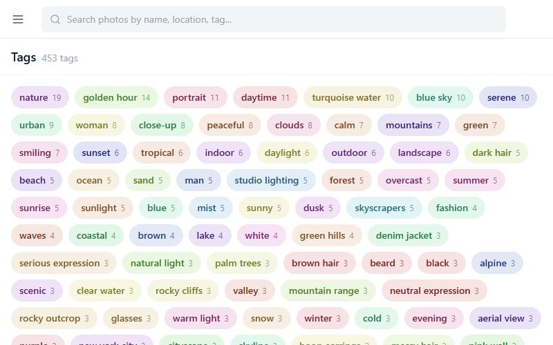 |
| *Search* | *Tags* |
| 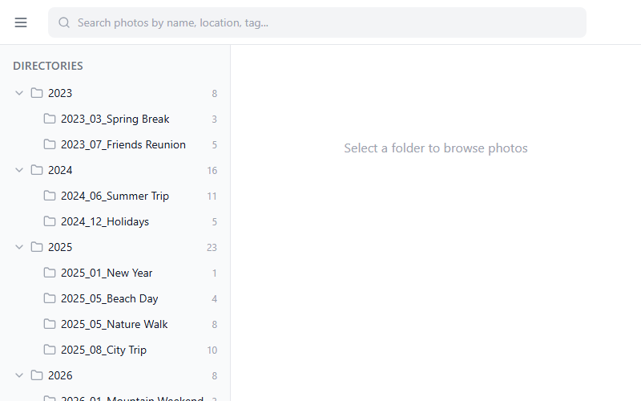 | 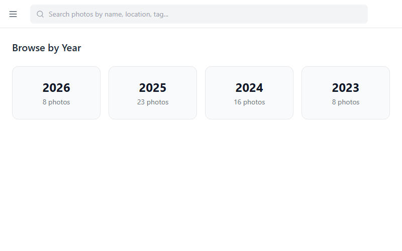 |
| *Folders* | *Years* |
| 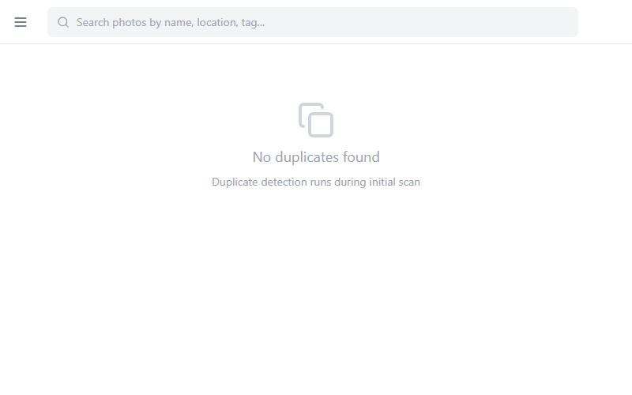 | 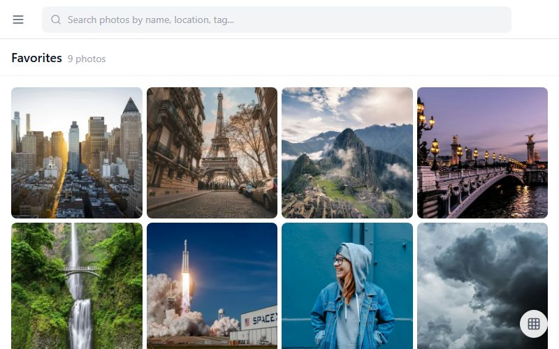 |
| *Duplicates* | *Favorites* |
| 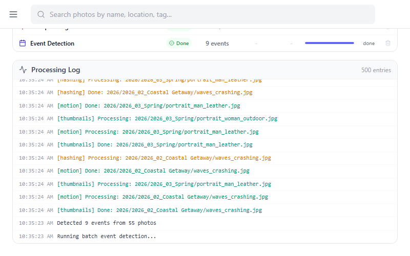 | 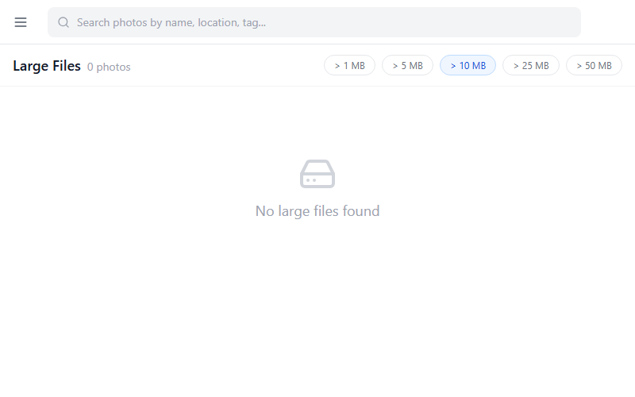 |
| *Pipeline* | *Large Files* |

## Configuration

All settings go in `.env`:

| Variable | Default | Description |
|----------|---------|-------------|
| `PHOTOS_PATH` | *(required)* | Path to your photo directory on the host |
| `RECASA_PORT` | `8080` | Port for the web UI |
| `OLLAMA_URL` | `http://ollama:11434` | URL for the Ollama API (optional) |
| `WATCH_INTERVAL` | `30` | How often to check for new files (seconds) |
| `LOG_LEVEL` | `info` | Logging level (`debug`, `info`, `warning`, `error`) |

### Processing stages

Each stage can be toggled independently. Already-processed photos are skipped on rescan.

| Variable | Default | Effect |
|----------|---------|--------|
| `ENABLE_EXIF_EXTRACTION` | `true` | Read camera metadata, GPS, and dates from photos |
| `ENABLE_GEOCODING` | `true` | Convert GPS coordinates to city/country names (offline) |
| `ENABLE_THUMBNAILS` | `true` | Generate WebP thumbnails at 200/600/1200px |
| `ENABLE_MOTION_PHOTOS` | `true` | Extract video from Live Photos and Motion Photos |
| `ENABLE_HASHING` | `true` | Perceptual hashing for duplicate detection |
| `ENABLE_FACE_DETECTION` | `true` | Detect faces and cluster them into people |
| `ENABLE_CAPTIONING` | `false` | Generate AI captions and tags (requires Ollama) |

### Ollama (optional)

Tags and captions require [Ollama](https://ollama.com) with a vision model. Without it, all other features work normally.

```bash
docker run -d --name ollama -p 11434:11434 ollama/ollama
docker exec ollama ollama pull qwen3-vl:30b-a3b-instruct
```

Add to your `.env`:

```
OLLAMA_URL=http://host.docker.internal:11434
ENABLE_CAPTIONING=true
```

## Supported formats

**Photos:** JPEG, PNG, WebP, HEIC/HEIF, TIFF, BMP

**Live Photos:** Apple (HEIC+MOV paired), Google Motion Photos (embedded MP4)

## License

MIT